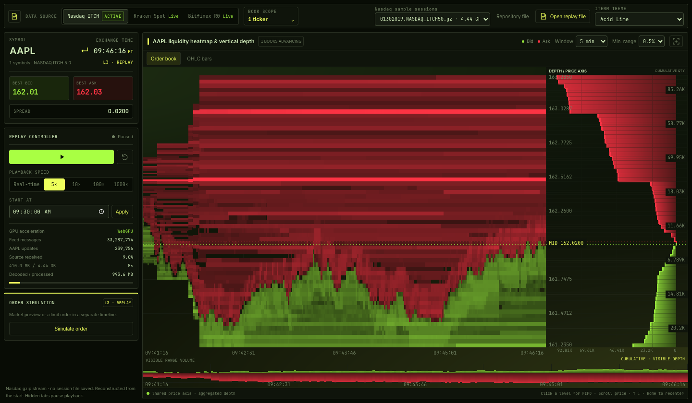

# LOBO

[](https://github.com/iamorlando/lobo)
[](docs/packaging.md)
[](rust/crates/lobo/Cargo.toml)
[](LICENSE-MIT.md)


```sh
pip install pylobo
```

- [LOBO](#lobo)
  - [Get started](#get-started)
  - [Build your own adapters](#build-your-own-adapters)
  - [Use LOBO in Rust](#use-lobo-in-rust)
  - [LOBO Is Highly Configurable](#lobo-is-highly-configurable)
  - [Further reading](#further-reading)


LOBO is a high-performance order book library built for fast replay. Written in Rust,
it exposes Python APIs to create and serve books through a [REST order API](rust/crates/lobo_server/README.md#order-api)
and an interactive [WebGPU terminal](web/README.md).

There are many fast ordebooks out there, the key reason you might consider using LOBO is when you need to adapt a new market data source. LOBO offers an expressive Python API to fully specify and map almost any market data source from its binary or JSON representation. The real beauty of LOBO is that it then JIT compiles your adapter into a zero-allocation parser streaming at native Rust/C/C++ speeds.

[](https://lobo-demo.vercel.app)

_Explore the [live demo](https://lobo-demo.vercel.app)._

## Get started

For Python, [build a wheel](docs/packaging.md#build-locally), then install it from the repository root:

```sh
pip install dist/pylobo-*.whl
```

To create and serve your first book, follow the [server guide](rust/crates/lobo_server/README.md)
or try the [standalone order API example](python/examples/order_api/README.md).

## Build your own adapters

Browse the [Python example adapters](python/examples/README.md) and [adapter reference](rust/crates/lobo_replay/src/custom/README.md). The examples cover Nasdaq ITCH, Kraken, Bitfinex, Polymarket, and LOBO's order feed.
You can also use the [agent skill](agents/README.md) to have an agent build one for you:

```sh
npx skills add iamorlando/lobo --skill lobo-adapter --copy
```
Then you can try prompt like this:
```text
build me the cme adapter for lobo, using the lobo adapter skill. then use a sample file
    https://cmegroupclientsite.atlassian.net/wiki/spaces/EPICSANDBOX/pages/457223111/MBO+FIX#MBOFIX-SampleFiles to show one book in the
  app
  ```

## Use LOBO in Rust

The Rust library is named `lobo`; its crates.io package name is `lobo-rs`.
Until the first registry release, add it from this repository:

```sh
cargo add lobo-rs --rename lobo --git https://github.com/iamorlando/lobo.git
```

After publication, use `cargo add lobo-rs --rename lobo`, or:

```toml
[dependencies]
lobo = { package = "lobo-rs", version = "0.1" }
```

All native Rust features are enabled by default, without Python bindings.
Use `default-features = false` for core order books, then select optional
features such as `replay`, `kraken`, `polars`, or `server` as needed.
See the [Rust API and examples](rust/crates/lobo/README.md) and
[workspace release guide](docs/rust-packaging.md).

## LOBO Is Highly Configurable
Lobo relies heavily on static dispatch, deferring nearly all configuration level control flow to compile-time resolution of generic types. To achieve this LOBO's order state is held in a single [generational slotted arena](rust/crates/lobo_storage/src/arena/arenav1.rs#L71), while all data structures beyond it operate only on [arena keys](rust/crates/lobo_storage/src/arena/arenav1.rs#L37). This enables full configurability of the [sorting](rust/crates/lobo_storage/src/price_sorting.rs#L244) and [storage algorithms](rust/crates/lobo_storage/src/price_level/mod.rs), allowing LOBO to implement the optimal ones for the given use case.
LOBO's state updates and sorting mechanics are configured via [policies](rust/crates/lobo_books/src/price_time_priority/mod.rs#L38) that resolve at compile time to specialized concrete types. The benefits of this also extend to Python. Python users simply select the configuration of the book in the [book's init](rust/crates/lobo_books/src/price_time_priority/python/book.rs#L158), this gets mapped by Rust to the [fully concrete typed implementation](rust/crates/lobo_books/src/price_time_priority/python/policies.rs#L7). A user [macro](rust/crates/lobo_storage/src/policies/matrix.rs#L4) facilitates this, enabling all combinatorial possibilities to exist in Python.


## Further reading

| Guide                                                  | What you'll find                                                     |
| ------------------------------------------------------ | -------------------------------------------------------------------- |
| [Server & REST API](rust/crates/lobo_server/README.md) | Host books, submit orders, and stream updates.                       |
| [Order book viewer](web/README.md)                     | Run the terminal locally; explore depth, OHLC bars, and simulations. |
| [Python notebooks](python/notebooks/README.md)         | Replay, custom adapters, and data exports.                           |
| [Build & packaging](docs/packaging.md)                 | Build and test Python wheels, including the bundled terminal.        |
