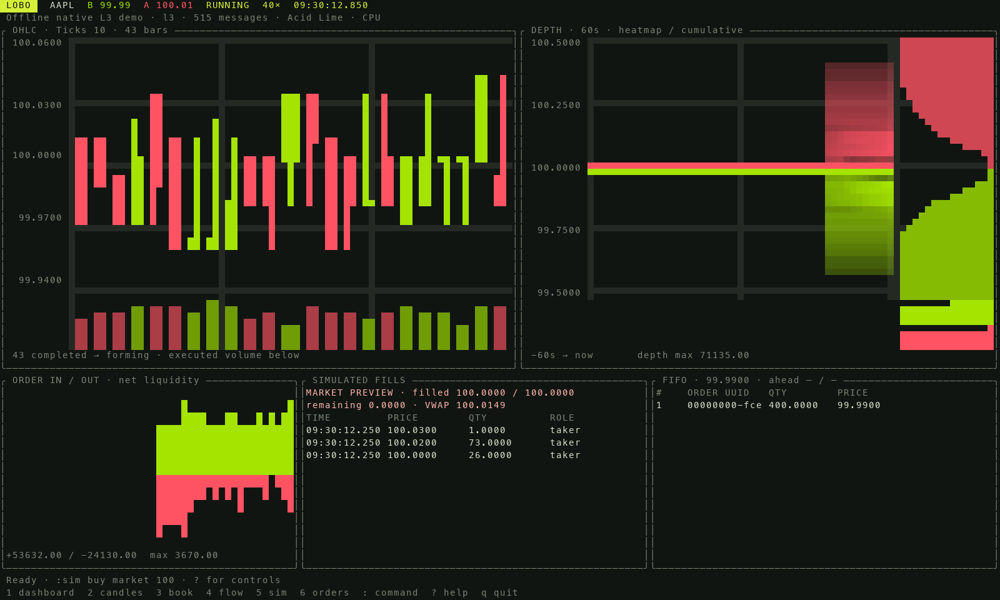
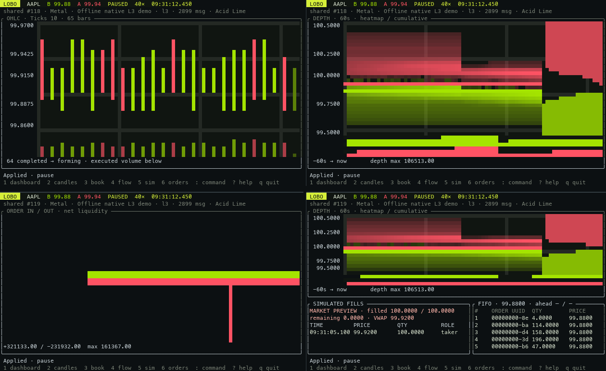

# Lobo terminal applications

An independent Rust application in `cli/`, beside `web/`. It links the existing
Lobo native adapters and matching engine; it is intentionally **not** a member
of the library workspace. The executable is `lobo`.



```sh
lobo                              # offline native L3 demo dashboard
lobo candles --source kraken --symbol BTC/USD --aggregation time --bar-size 5
lobo book --file /path/session.gz --symbol AAPL --start-at 09:30:00 --speed 10
lobo flow --file /path/session --symbol MSFT --history-seconds 120
lobo simulate --source demo --side buy --order-kind limit --price 99.98 --quantity 200
lobo orders --source demo --queue-price 99.99 --side buy
```

Each command runs in its own terminal pane. Attach panes to a shared session for
one feed, clock and simulation. `lobo dashboard`
combines candles, depth, flow, simulated fills and FIFO in one process. Press
`1`–`6` to switch views. Charts use true-color half blocks, responsive layouts,
price axes, native quantity scales, and a deliberately small control surface.

## Installation and distribution

The build produces **one executable**. Runtime does not need Python, Node, Rust,
wasm-pack, npm packages, a browser or a separate Lobo server. Five palettes and
an offline native L3 demo are compiled into the executable. Public feeds need
network access; custom upstream themes are downloaded only when requested.

[Lobo terminal 0.1.0](https://github.com/iamorlando/lobo/releases/tag/cli-v0.1.0)
is available for macOS Apple Silicon/Intel and Linux ARM64/x86-64
(macOS 12+; Linux glibc 2.35+), with shell completions and SHA256 checksums.
The [Homebrew tap](https://github.com/iamorlando/homebrew-lobo) provides
dependency-free, relocatable bottles. Homebrew pours the executable directly,
so no compiler or Rust install is needed:

```sh
brew install iamorlando/lobo/lobo
# Or once:
brew tap iamorlando/lobo
brew install lobo
```

A bare `brew install lobo` on an entirely untapped machine needs acceptance into
Homebrew core. Current Homebrew also requires trust for third-party formulae;
when requested, use `brew trust --formula iamorlando/lobo/lobo`. A custom tap
cannot make itself globally discoverable. See
[Homebrew's tap installation instructions](https://docs.brew.sh/How-to-Create-and-Maintain-a-Tap).
No additional runtime install is needed.

For development, from the repository root:

```sh
CARGO_TARGET_DIR="$PWD/cli/target" cargo build --manifest-path cli/Cargo.toml --locked --release
./cli/target/release/lobo
```

Use `--manifest-path cli/Cargo.toml` for all Cargo commands. Do not run workspace
format/fix commands on the protected `rust/` tree.

## Views and matching web inputs

| Web capability | Terminal command / control |
|---|---|
| OHLC bars and executed volume | `candles`, `--aggregation`, `--bar-size` |
| Depth heatmap and cumulative depth | `book`, `--history-seconds`, `--min-range` |
| Orders in/out | `flow`: observed net visible level increases/decreases |
| Market preview | `simulate --order-kind market --side buy --quantity 0.125` |
| Isolated L3 limit timeline | `simulate --order-kind limit --price 99.98 --quantity 200` |
| FIFO queue and quantity ahead | `orders`, `--queue-price`, `:queue buy 99.98` |
| Replay source | `--file`, `--url`, `--source nasdaq --session NAME` |
| Live source | `--source kraken`, `--source bitfinex`, `--source server --url ws://…` |
| Symbol and book scope | `--symbol`, `--scope all/top-tech/sp500/AAPL,MSFT` |
| Exchange start clock and speed | `--start-at 09:30:00`, `--speed 1/5/10/100/1000`, `--paused` |
| Theme | `--theme NAME`, `--theme-file /path/scheme.toml`, `:theme NAME` |
| Pan, zoom, recenter | arrows, mouse wheel, `+`/`-`, `Home`, `:range 2` |
| Return to main timeline | `m`, `:main` |

Volume bars split executions at exact quantity boundaries. Time bars use aligned
source timestamps and emit no empty periods. Tick bars count execution messages.
Notional bars include the whole crossing execution. All use the existing native
aggregator, including decimal scaling for live assets. An unfinished candle is
dimmed; its volume remains visible. At most 80 bars are displayed and `--capacity`
(default 256) bounds retained bars, flow samples and depth frames for each book.

Flow reports **net** level changes between native observations. Changes at the
same price may coalesce; departures include both executions and cancels. It is
not an execution tape or a count of individual cancellation messages.

The default scope is the selected symbol to avoid allocating every Nasdaq book
in a small pane. `top-tech` and the web app's dated SPY holdings (`sp500`) are
bundled presets; missing tickers simply never allocate a book. `all` keeps the
complete feed directory. Changing a ticker preserves its native book and history.
For live feeds, explicit scope subscribes its symbols; `all` discovers the
directory and subscribes as visited. Applying a new scope/source/start reconstructs
from the beginning, as in the web app.

## Sources

```sh
lobo sessions                         # list Nasdaq's real ITCH 5.0 files
lobo book --source nasdaq --session 01302020.NASDAQ_ITCH50.gz --symbol AAPL
lobo candles --url https://example.com/session.gz --symbol AAPL
lobo book --source bitfinex --symbol tBTCUSD
lobo book --source server --symbol BOOK --url ws://127.0.0.1:8765/api/feed
lobo book --source server --url ws://127.0.0.1:8765/api/adapters/0/feed --descriptor adapter.json
```

Local/HTTP replay accepts length-prefixed NASDAQ ITCH 5.0, raw or gzip (including
concatenated gzip members). HTTP streams without downloading the session to disk.
Books reconstruct before `--start-at`; playback remains responsive in bounded
work slices. Native transports provide reconnect, subscription restoration,
Kraken checksum validation and bounded transport queues. Feed errors are shown in
the footer; `r` reopens the source. Native observed adapter descriptors let a
hosted custom feed use the same adapter contract as the browser.

L2 live feeds allow nonmutating aggregate market previews, with no invented maker
IDs or FIFO queue. L3 replay limit simulations fork the native book; source orders
and candles continue on the main timeline. A fully filled/stopped branch freezes
its chart clock; `m` returns to the main timeline. An unfilled EOF remainder stays
unfilled. Decimal price/quantity input must match the instrument's precision.

## Interactive command line and order entry

Press `:` and enter a command; `?` lists syntax. For example:

```text
symbol MSFT
aggregation volume 5000
aggregation time 5
aggregation ticks 100
aggregation notional 100000
theme Tokyo Night
scope AAPL,MSFT
start 09:30:00
speed 10
sim buy market 100
sim sell limit 250 100.05
queue buy 99.98
main
```

`orders` supports `add`, `limit`, `market`, `cancel`, `execute`, `modify` and
`remove`. Native local commands are enabled for the offline demo. To submit to a
hosted book, explicitly configure its command endpoint:

```sh
lobo orders --source server --url ws://localhost:8765/api/feed --symbol BOOK \
  --order-endpoint http://localhost:8765/api/books/BOOK/orders
```

Then `:add buy 99.98 100` sends the same typed native command as the web/server API;
`:market buy 100` matches and `:limit buy 99.98 100` matches/rests. Inputs use
**displayed** units; conversion to server integer atoms occurs once. HTTP writes
run off the rendering thread, display their response/error, and are never retried
automatically. CLI startup never submits an actual order. Use full order UUIDs
from wide FIFO rows or JSON capture for cancellation/modification. A numeric
row index also works: `:cancel 1 10` targets the currently displayed first FIFO
order. Row indexes are resolved to UUIDs before submission.

## Rendering and performance

`--renderer auto` requests a physical Metal/Vulkan/DX12 device. The bundled WGSL
compute kernel rasterizes candles, unfinished bars, volume, liquidity heatmaps,
best quotes and cumulative depth into a terminal-sized pixel buffer. A small
readback translates those pixels into `▀` foreground/background RGB cells.
Ratatui diffs the previous screen and writes only changed cells.

This is real **GPU chart computation**. Terminal glyph composition is handled by
the terminal emulator. It is not a browser WebGPU canvas embedded in the terminal.
The tiny readback and escape-sequence throughput set the practical performance
limit; `--fps` defaults to 60 and caps at 120. Hardware acceleration does not
promise a sustained frame rate on every terminal or data rate. Depth raster
work scales with visible levels/history and pane resolution.

Use `--renderer gpu` to require hardware and fail visibly if unavailable.
`--renderer cpu` uses the same raster math for SSH/headless systems; auto falls
back when a physical GPU is unavailable. Standard ANSI cells work through tmux
and do not rely on Kitty/Sixel support. True color is required to distinguish chart pixels; interactive chart output
preserves RGB even if `NO_COLOR` is inherited. Without `--attach`, a view owns its
feed. With `--attach`, every view renders the same native session state.

### One shared session in cmux, tmux or another split terminal

Start the data session once (in a spare pane or in the background):

```sh
lobo session --socket /tmp/lobo.sock --file /path/session.gz --symbol AAPL \
  --start-at 09:30:00 --speed 10 --aggregation time --bar-size 5
# Or use --source demo / kraken / bitfinex and their usual source arguments.
```

Then run a different view in each pane:

```sh
lobo candles  --attach /tmp/lobo.sock --renderer gpu
lobo book     --attach /tmp/lobo.sock --renderer gpu
lobo flow     --attach /tmp/lobo.sock --theme Nord
lobo simulate --attach /tmp/lobo.sock --renderer gpu
lobo orders   --attach /tmp/lobo.sock
```

The session owns the source, selected symbol, replay transport, aggregation,
history, FIFO selection and simulation. Commands from any attached pane update
that shared state. Themes, view selection, pan/zoom and frame rate stay local.
Attaching a simulation pane does not start a new simulation or overwrite one
already running; use `s` or `:sim buy limit 100 99.98` when ready. Startup arguments
on the session configure data; presentation arguments on panes configure rendering.
Each header shows `shared #N`, identifying the published snapshot it renders.
Panes draw independently, so their displayed sequence may differ briefly.

The native feed is read and reconstructed once. Unix sockets publish bounded
snapshots, send depth-history deltas, and let slower panes skip to the latest
state. A slow or closed pane does not stop the others. Session sockets are
private to their owner (mode 0600) and removed on stop, Ctrl-C or SIGTERM.

A control terminal or script can also issue commands:

```sh
lobo ctl --attach /tmp/lobo.sock --execute 'pause'
lobo ctl --attach /tmp/lobo.sock --execute 'sim buy market 100'
lobo ctl --attach /tmp/lobo.sock --execute 'main'
lobo ctl --attach /tmp/lobo.sock --execute 'stop'
```

The package includes `lobo-tmux`, a launcher for candles, book, flow and simulation
panes attached to one session. It uses your existing tmux installation. From a
source checkout, use `./cli/examples/tmux-dashboard.sh` instead:

```sh
lobo-tmux --file /path/session.gz --symbol AAPL --speed 10
# Local build:
LOBO_BIN=./cli/target/release/lobo ./cli/examples/tmux-dashboard.sh --source demo
# Reuse an existing session:
LOBO_SOCKET=/tmp/lobo.sock lobo-tmux
```

The launcher preserves the feed on tmux detach and stops its owned feed after the
last pane closes. `LOBO_RENDERER=gpu`, `LOBO_THEME=Nord`, and `LOBO_TMUX_SESSION=name`
customize it. cmux and other split terminal emulators use the same `--attach`
commands directly; Lobo does not require any particular multiplexer.



Measure the native renderer on your own machine:

```sh
lobo benchmark --attach /tmp/lobo.sock --renderer gpu --width 90 --height 25 --frames 120
```

This reports median and p95 snapshot/layout/raster/readback time per view,
excluding terminal escape output. GPU buffers are retained across frames and
liquidity is combined at terminal pixel resolution, so per-pixel raster work is
bounded by the viewport. The frame scheduler accounts for drawing time instead
of adding drawing time to every requested frame interval.

## Themes, diagnostics and checks

```sh
lobo themes                           # bundled offline palettes
lobo themes --all                     # complete upstream WezTerm catalog
lobo book --theme-file ./theme.toml    # offline custom palette
lobo completions zsh > _lobo
lobo --snapshot-json --renderer cpu --capture-seconds 2
lobo candles --snapshot-text --renderer cpu --width 140 --height 44
lobo book --frames 300                # finite interactive profiling run
```

Additional iTerm2-Color-Schemes palettes are fetched from the same upstream
repository as the web app and cached under `$XDG_CACHE_HOME/lobo/themes` (or
`~/.cache/lobo/themes`). Built-in palette names are curated terminal defaults.
Local TOML accepts a `[colors]` section containing `background`, `foreground`,
and eight `ansi` colors. Theme changes preserve state and simulation.

```sh
CARGO_TARGET_DIR="$PWD/cli/target" cargo test --manifest-path cli/Cargo.toml --locked
CARGO_TARGET_DIR="$PWD/cli/target" cargo clippy --manifest-path cli/Cargo.toml --locked --all-targets -- -D warnings
CARGO_TARGET_DIR="$PWD/cli/target" cargo test --manifest-path cli/Cargo.toml gpu_matches_cpu -- --ignored
python3 -m unittest discover -s cli/packaging -p 'test_*.py'
```

Shared-session and real tmux smoke tests cover identical published state, shared
transport/simulation/FIFO, slow-pane isolation, lifecycle cleanup and RGB output.
Native tests cover all four bar semantics, nonmutating previews, forked FIFO,
precision rejection, bounded history and rendering at small pane sizes. GPU
parity is a separate opt-in test because CI runners may lack physical GPUs.

The publisher generates a formula only if **all four actual archives** exist;
it never emits placeholder hashes. It generates four relocatable Homebrew
bottles from those verified archives, including executable modes, completion
paths, install receipts and separate real checksums. Build/publish instructions are in
[packaging/RELEASE.md](packaging/RELEASE.md).
